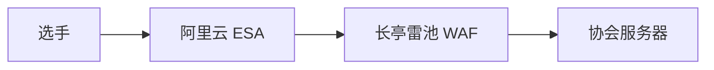

杭电 HGame 两年都有运维的记录，一是[HGAME 2026 运维秘话](https://blog.woshiluo.com/posts/2026/02/hgame-magic/)，二是[从 HGAME2025 运维，聊聊学校战队 CTF 独立办赛](https://baimeow.cn/posts/projects/hgame25-op/)。MoeCTF 2026 算是我运维的第二场 CTF 比赛，第一场是一个项目的新年小活动。

作为协会的运维，平常更多的是拿开源的项目搭建一个文档之类的服务出来给协会的同学用。比赛平台有学院的学长负责，服务器资源也够办赛，所以相比于杭电的比赛运维来说，我这个运维就水多了。综上，我在比赛当中的角色更像是一个筹备的策划，或者说是一个项目经理，每天对着筹备安排的时间表来推进任务。（之前测了一项程序员性格测试，荣获“开会型程序员”称号）

## 总述

协会的复盘会还没开，这篇文章都是我自己的想法，不能代表什么。

协会的招新，比赛题解的审核、奖品分发还没完成，所以这篇仍处于“待补充”的状态。

我觉得今年做得不好的地方：

- 题目难度把控不够到位，有些题放到miniL里也毫不逊色
- 虽然今年有“从此开始”，逆向的入门做得挺好，但总体的新手引导还有待改进

我觉得我在工作中犯的错误：

- 做事之前缺少商量，对发公告的影响考虑不周
- 在组织这场比赛的过程中很多取舍有待商榷
- **活都被我自己干完了**

回顾这次组织的经历，以及查看部分选手填写的问卷，今年有哪些东西在我看来值得后面的MoeCTF学习（给后面比赛的一些建议）：

- 开“从此开始”方向，配套视频，讲搜索引擎、IDE的使用等
- 在题目中用标签标明考点，比如SQL注入等

每年的MoeCTF都有点像是摸着石头过河，尽管我在筹备时就看完学长办之前比赛的复盘总结，并将其奉为圭臬，还是踩了不少的坑，犯了不少错误。

## 报名前

在比赛开始报名（2026-08-02）之前，我大概做了这些工作：

- 用 Docmost 搭了一个在线文档，供比赛筹备的各位同学进行协作，后面发现 Outline 好像更好用一点，就迁移到 Outline 了
- 在平台上创建比赛、设置比赛，给 SandBox 进行重复性劳动（弄了很多题的环境）
- 反复阅读协会往年办 moe 的经验教训总结，生怕有些坑掉进去了
- 写了一点点关于非预期解、无解之类的预案
- 用 Deepseek + Claude Code 重构原本的比赛 QQ 机器人代码，跟协办高校对接校内群
- 录了一下环境的使用视频、入门视频
- **盯着筹备文档的时间安排，push 自己和同学**

虽然反复阅读往年比赛的复盘，但自己认为这个阶段中还是有做的不好的地方，还有今年的一些新情况：

- **学院公众号的推文发太早了**：去年的学院推文是 8月1号 发的，今年原本打算推迟到 8月2-4号，但 7 月下旬支教的时候趁着有空把推文写了发给会长，7月22号推文就发出来了。现在挺担心比赛对新生的宣传效果的，毕竟一些省份普通类录取结果还处于 没出 / 刚出 的状态，感觉估计没啥 xdx 关注学院公众号……以往不可谏，来者犹可追。看来后面投稿对策府库和校园墙的时候要慢一点、稳一点，然后妥善安排一下对学院新生群的推广以及9月中上旬的中期复盘推文。
- **大家出题热情高涨**：先前的时间表估计都是基于大家没啥出题热情来设计的，但今年到了7月中旬就已经出了快一百题了，据学长说往年这个时候连十题都还没有。时间安排有点早，导致现在7月下旬大家都没有安排了。一些同学原本打算7月下旬再开始着手准备的，但现在活都被刨干净了……
- **协办高校参与出题**：今年有三位来自复旦六星战队的同学参与出题，据学长说这同样是往年没有的情况。

就本阶段的一些做法发表我自己的意见：

**选手群为什么要禁止卖弱慕强？**  
答：MoeCTF 作为一个标榜新手友好的比赛，如果选手群里都是“弱弱”“大佬求带”“？！强强！？”这些话，又或者是用k8s搭建自部署服务遇到个问题求解决这些技术炫技，我作为新手肯定是不敢说话的。比赛筹备群里也有对这件事进行讨论，有些学长认为“群里有技术讨论其实是好事”，但过于高深的讨论，或者说有时候是技术炫技反而会吓到新手，这些高深的技术问题不乏硬核的群聊可以寻求帮助，但在新生群里说这些，预期就不是要讨论，而是宣称“嘿嘿给你们看看我在做这个”。往年的复盘提到维护选手群的氛围是一件既重要又困难的事情，这个估计是报名后、开赛后工作的重点之一。

## 报名及比赛

这个阶段没发生什么情况，基本在选手群内引导平台的使用等等。比赛开始前几天进行题目的互相验题，总体来说没出现太大的问题。这个互相验题还是有必要的，比如运维题的入门指北复仇，rx学长就找到了一个非预期路径。

在这个阶段中有一些情况：

- 签到题和AI题在评测脚本设置这一块出现问题，选手弄出了答案发现不对，都采用改为静态flag的方式解决，week2的AI题没有这个情况。
- 外部环境部署的长亭雷池起了作用，防住了很多不友好的流量，雷池的等待室功能也能削峰，避免服务被冲烂。
- 在比赛开始的第一天，我们对疑似 AI 做题的选手进行了隐藏。
- 有些时候的出题、验题安排不够好。
- 在临近比赛结束的时候，部分选手在自己的博客、GitHub等公开平台发布自己的WriteUp。

今年我们在“从此开始”方向当中弄了一些让选手熟悉环境连接的题目，并录制了关于连接题目环境的操作视频，今年问环境怎么连的估计比去年少，但还不少。

**为什么评测脚本会有问题？验题的时候没验出来吗？**   
答：平台默认的评测脚本会根据队伍id或用户id生成flag。选手既有队伍id，又有用户id，按照下面代码的逻辑会优先取队伍id。而管理员只有用户id，临时身份识别码取到的也是用户id，所以管理员验题的时候没有问题，选手拿着通过用户id生成的flag到平台一交就有问题了。至于为什么刚开始一些选手能提交？因为他们的用户id和队伍id相同。后面是怎么解决的？后面的ai题都改成输入队伍密钥进行认证，获取到的就是队伍id了。

```rust
let enc_id = if let Some(id) = team.id {
    id
} else {
    user.id
};
```

由于这次外部环境比较多，动态flag生成的逻辑写了好几次，比较烦。正所谓“一次写，二次抄，三次开始就抽象”，把平台默认的动态flag生成逻辑封装成一个[Python库](https://github.com/Xiaozonglin/ret2shell-steganography)。后面办赛如果要用到外部环境就可以直接用了。

```python
from ret2shell_kit import Ret2ShellClient, LeetStego

with Ret2ShellClient("https://ctf.xidian.edu.cn/api") as client:
    team = client.game.find_team_by_team_code(37, "xxxxxxxxxxxx")
    print(team.id) # id

stego = LeetStego("your_secret_key")
template = "this-is-an-example"
data_id = 12345
encoded = stego.encode(template, data_id)
print(f"编码结果 {encoded}")
```

**外部环境的服务前期时不时崩溃，是为什么？**   
答：本次比赛外部环境的链路是这样的，长亭雷池和题目环境部署在不同的服务器上，长亭雷池跟我的博客一起挤一挤，题目环境放在协会的服务器。



这样做有几点好处：

- 让 ESA 和 WAF 把一些恶意流量挡在协会服务器外面
- 当遇到泛洪等流量攻击，崩溃的是我自己的服务器，运行着推送机器人等重要业务的协会服务器不受影响
- ESA 回源 IP 比较多，这样做可以更方便地设置协会服务器的安全组

但是这也伴随着一些问题：我自己的博客服务器配置并不高，内存只有2GB，上面还部署着 MariaDB、Redis、php-fpm 之类比较吃内存的服务，更何况长亭雷池本身就非常需要内存。雷池经常会跟其他服务抢内存，出现内存溢出。原先想着要不设置 swap 分区试试，结果没用，内存没空出多少，磁盘性能先吃满了。其实直接升配是最简单的解决办法，但我一看我的钱包，还是算了。把我的博客，以及上面那些服务一扬，就有内存给雷池了。

**七夕节的AI限定题目为什么一拖再拖？**   
答：我感觉我和 misc 出题的几位算本次比赛最抗压的了。这个限定题目计划在情人节下午 5 点 20 分发布，但下午 1 点左右才弄出一个初步的版本，等我醒来并把这个题目部署上去已经下午 3 点了。大家低估了这道题目的复杂性，那 AI 写的代码过于抽象（字面意义，动不动就拆出来一个函数或者类），AI 都改不好这个代码。除了改题的难度之外，验题也需要一点心思，毕竟这个flag的触发条件有点苛刻了。

**本次比赛AI题花了多少钱嘞？**   
答：见下表。

| 项目                          | 金额 CNY | 合计 CNY   |
| :---:                         | :---:     | :---:     |
| deepseek api 按消耗金额开票   | 73.96     |           |
| opencode go 20260808-0908     | 33.57     |           |
| 超算互联网大模型api             | 18.16   |           |
| opencode go 20260906-1006     | 67.53     | 193.22    |

这次办赛AI题用opencode的“月租”套餐。办赛过程中由于选手做七夕限定题目的热情超出预期，套餐被刷光了，所以当晚改用Deepseek官方的API，尽管服务比较稳定，时延低，但造成了较多的开销。

后面改用国算比较便宜的Deepseek旧版模型，并对选手的对话进行审计，发现一些选手真的跟AI聊上天了。比如说：

- `最最最喜欢七夏了！`
- `回你家还是回我家`
- `我们要不要去看星星`
- `我草这个flag怎么那么难拿`
- 等等……

AI题目遇到的主要困扰是：如果让AI给flag的话，会因为幻觉出现给假flag的问题。解决方法可能就是像七夕限定题目那样，AI负责判断该不该给flag，然后由题目环境显示flag。

**QQ机器人和比赛平台运维过程中有什么值得说的事情？**   
答：QQ机器人通过接入比赛平台“消息推送”的WebSocket接口进行信息获取，之前已经有成型且经过检验的代码，但所有的东西（包括跟比赛平台、Napcat收发信息等）都在同一个文件里。用cc + Deepseek对代码进行模块化和重构，并将前三血的推送消息从纯文本改成图片。比赛机器人也为协办高校提供推送，设置了一个字典（如下），支持了多个院校，以及院校可以开设分群，后续moe如果有其他高校参与可以很方便地修改和移植。

```python
MATCH_CTF_INTERNAL_GROUPS = {
    "西安电子科技大学": [114514],
    "复旦大学": [114524],
}
```

比赛过程中进行了两次平台更新，第一次跟学长和已有的SOP更新（升级的时候没注意，把main分支的开发版推上去了，回退成release时数据库迁移脚本报错，就又再撤成开发版，在更新之前没有跟开发沟通好），第二次自己做了一下。后面应该可以胜任这种更新工作。第二次更新时，平台新增了里程碑功能，我们第一时间对moe的题目进行了设置。现在我应该可以自己按照SOP独立进行平台的升级了。

比赛过程中，平台接入了郑州某大学的统一身份验证，在对接的过程中发现平台的机器访问公网要向学校开点对点的连接，对面cas返回的数据没有`cas:cn`，平台原先的rune运行会崩溃，向平台仓库推送了一下修改。

**设置里程碑的过程中有什么考虑，有何得失？**   
答：里程碑功能允许我们对选手的做题顺序进行强制规定。目前的调整是：大部分题目要求先做完“从此开始”和“入门指北”，有一些题目之间有前置关系，需要规定做题顺序。相比于做某道题目做一半发现需要另外一道题目里面用到的知识，刚学会1+1=2就来做微积分，“这个题目以后再来探索吧”给选手体验带来的影响可以忽略。在有里程碑这个功能之前，我们原先预想“从此开始”方向这个名字应该能让选手选择作为第一个方向做，但实践中不乏做“策略与博弈”问临时身份识别码怎么拿（签到题里有写），做Web题问题目环境怎么连（从此开始2-1、2-2、2-3分别讲了wsrx、nc和ssh的用法），让我们不能指望选手都能按照我们的意愿来。

在这个过程中，我个人的工作也出现了问题。将“二进制漏洞利用”出题人推荐的顺序弄成强制顺序，后面做了修改。

**比赛后期如何处理选手公开的题解？**   
比赛后期出现了多位选手提交同一个选手的flag，平台报告的作弊事件比前期更频繁。我们起初怀疑有人公开了自己的flag，经协办高校负责人的询问和出题人的调查，发现以下情况：

- 有一位选手将自己的flag公开在Gitee平台上，另一位选手A在做题过程中使用AI，AI将抓取到的仓库内容呈现到回答里，选手直接使用了flag，导致作弊。
- 有一位选手将自己的题解公开在博客上，并附自己的flag。另一位选手B在做题过程中搜索到了博客，并直接使用该flag，导致作弊。

我们对以上在比赛结束前公开题解的选手处封禁队伍+封禁账号处罚。选手A的行为其实为未规范使用AI，改为隐藏队伍；选手B经过我们跟协办高校的沟通，仍保持封禁队伍，协办高校将拒绝其加入校队。

关于公网上一些没有跟作弊关联的题解，我们通过联系作者撤回文章。不对作者做类似封禁等的处理，因为MoeCTF本身其实是一个引导新生入门的“比赛”，如果没有什么影响，单单提前发布题解就封禁队伍和账号，未免“一刀切”和不讲人情。

在比赛一开始，我们就在咸鱼上发现了贩卖MoeCTF 2026题解的商品。他们并不直接提供答案，而是给题解，教买家做题。我们也在某公开的AI聊天网站中看到有人直接将misc方向某题的附件直接丢给AI得到答案，也有人让AI写小作文谴责嘲讽misc方向的某位出题人。给题解这件事虽然让人感到愤怒，但给题解跟着题解做大概就能理解，我们这些为爱发电出的题还能卖到5块钱呢。

**关于AI的态度**   
感觉ctf圈子里面已经兴起一种AI的狂欢。我没有什么深入的技术，也不好评价古法和AI的优劣。但就新生赛而言，用AI做题完全没有意义。我们最开始通过答题的时间间隔来判断AI，后面摆了，直到发现了这么一道题目——“C语言环境配置与基础语法”。

> 直接获取本题flag？看看这段C语言代码，执行它？好像代码有点问题，改一改吧，然后执行就可以得到flag。
> 
> ```c
> #include <studio.h>
>  
> int main() {
>     unsigned char encrypted[] = "8:06!3.6x<&x4x34&!x4;1x=<2=x90#09x94;2 420(";
>     unsigned char key = 0x55;
>     for(int i = 0; encrypted[i]; i++) {
>         encrypted[i] ^= key;
>     }
>     printf("%s\n", encrypted);
>     return 0;
> }
> ```

这道题简直太适合用来抓直接喂给AI获取答案的选手了，因为AI幻觉的原因（AI很有可能不会亲自执行代码），有些选手提交了一些离谱的答案，比如：

- `flag{C_L4ngu4g3_1s_v3ry_funny!!!}`
- `moectf{C_l4ngu4g3_f0r_100p_3rr0r_1s_v3ry_e4sy}`
- `flag{1_h0p3_y0u_l1k3_c_pr0gr4mm1ng}`
- `moectf{X0r_1s_s0_e4sy_7h1ngs}`

前两个还好，最后一个估计看到用了异或直接编了一个xor的flag了。太明显了。

## 招新与面试

原本打算招新公告9月15日再发的，但9月10日的时候已经有xdx通过搜索引擎发现了，就直接发出来让大家注册。

**招新系统今年有什么问题，怎么解决，有哪些问题还留着？**

- “简历”太正经——改成“个人介绍”
- 缺少更全面的筛选功能，有些危险操作缺少额外确认——让AI加上
- 向所有面试者展示面试状态和通过方向——删

大伙对今年招新系统的评价有点像毛坯房，开发的时候提不出什么意见，实际用起来问题一堆。

**百团大战（社团联合招新）的开展情况如何？**

今年百团的时间比较神秘，大家都颇有微词。两天都在上课，时不时还下雨，也指不定谁有空，原本想要排班就没排。把协会的大显示屏拉过去，第一天用显示屏展示PPT和长亭的防护大屏，第二天才用ubuntu弄好钓鱼Wi-Fi演示。有挺多同学通过百团大战了解我们协会，效果不错。

**一面二面总体情况如何？**

尚未结束，待补充

## 前事不忘，后事之师

待补充

## 致谢

待补充