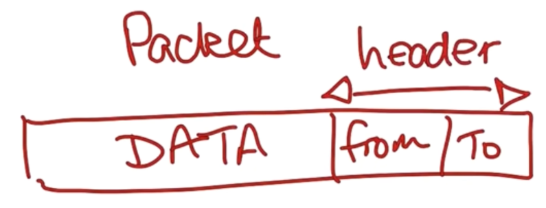
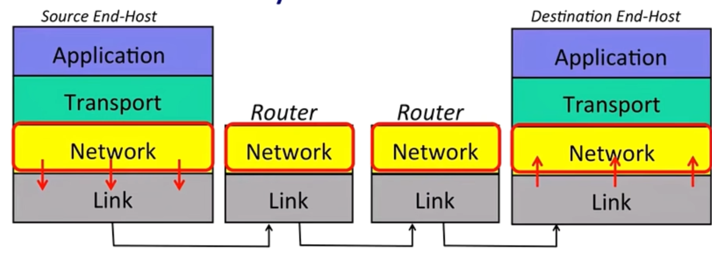
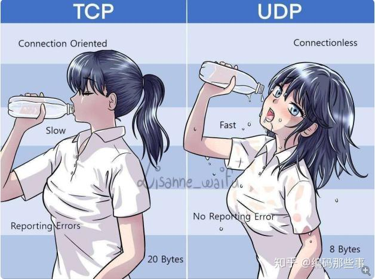

# 4层与7层互联网模型

为了实现协议的复用，避免重复设计，计算机网络的先贤们设计了一套分层模型。每一层协议都有不同的职责，每一层都在下面一层的基础上构建服务。

## 链路层Link Layer

我们的网络由主机、路由器、链路等元件组成。我们的数据在网络中以包（packet）的形式传输，数据包内有我们想要传递的数据以及一个报头，报头告诉网络数据包要传递到哪里，从哪里来等等。链路层负责将一个个数据包沿链路逐跳（hop）传输。

例如，以太网（Ethernet）和Wi-Fi是两种链路层的例子。

## 网络层Network Layer

网络层负责端到端传输数据包。

网络层与链路层一起配合将数据包发送出去，但网络层不需要关心数据包是如何在网线或空气等介质中传输的。

IP（Internet Protocol）是一种网络层协议。看名字可以知道，如果我们要在互联网（Internet）中通信，我们必须使用IP。IP报文会丢失、乱序、损坏，没有保证。

读到这可能会感觉奇怪，IP协议并不保证可靠性，那我们的网络是怎么可靠运行的？这就是传输层的任务。

## 传输层Transport Layer

TCP（Transmission Control Protocol）确保应用程序在互联网一端发送的数据能够正确地按顺序传递到互联网另一端的应用程序。

如果网络层丢失了一些数据报，TCP会根据需要进行多次传输。TCP会将因网络和链路层原因导致乱序的数据按正确的顺序排列。

上层的应用程序可以直接使用TCP来可靠地传输数据，而不用考虑实现原理。

对于不太需要重复传输数据的应用，例如直播等，如果丢失了数据包，那就继续发新的数据包，而不是重发，UDP（User Datagram Protocol）更适合它们。

> 
> 一般情况下TCP是这样的：
> TCP发送方：你准备好了么？我准备发了哦。
> TCP接收方：好嘞，你发吧，我准备好了。
> 于是，双方很愉快的进行通信传输了。
> 
> 再看下UDP是什么样的：
> UDP发送方：哎呀，终于睡醒了，干会活吧，开始发喽……
> UDP接收方：我还没准备好呢，等等我，慢点，慢点……
> 于是，发送方、接收方都各自为政，互不干涉，发送方不关心接收方是否接收完整，接收方也无从判断发送方是否开始发了。
> ref: https://zhuanlan.zhihu.com/p/273218681

## 应用层Application Layer

