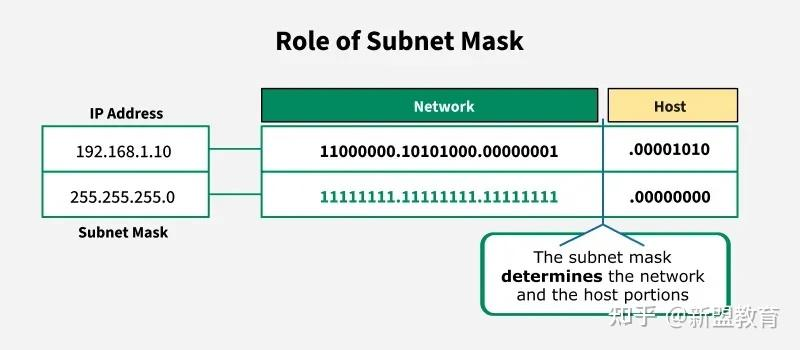
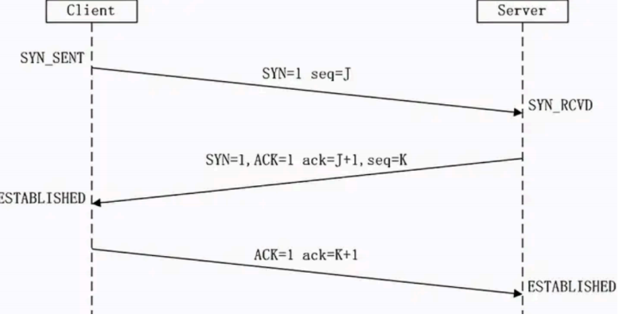
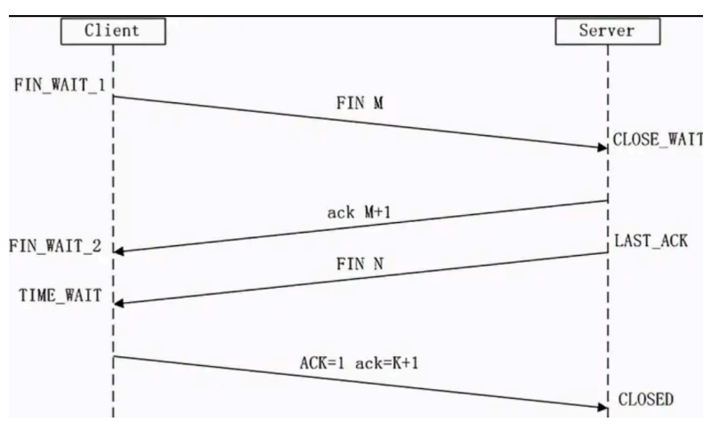

# TCP/IP协议

TCP和IP分别是传输层和网络层的协议，TCP和IP在一起协同工作。

## IP

每个计算机必须有一个 IP 地址才能够连入因特网。

每个 IP 包必须有一个地址才能够发送到另一台计算机。

网络上每一个节点都必须有一个独立的Internet地址（也叫做IP地址）。现在，通常使用的IP地址是一个32bit的数字，也就是我们常说的IPv4标准，这32bit的数字分成四组，也就是常见的255.255.255.255的样式。IPv4标准上，按照A/B/C类分类，地址被分为五类，但现在常用CIDR表示。需要注意的是IP地址是网络号+主机号的组合，这非常重要。

IPv4 使用 32 个比特来编址。一个计算机字节是 8 比特。所以 IPv4 使用了 4 个字节。 一个计算机字节可以包含 256 个不同的值： 00000000、00000001、00000010、00000011、00000100、00000101、00000110、00000111、00001000 …….直到 11111111。

除了IPv4地址之外，还有由128位二进制组成的采用十六进制表示的IPv6地址。现在越来越多的应用支持IPv6。

另外，2026年4月14日，IETF公布了IPv8核心协议草案，但该草案目前仅为技术提案，未成为IETF官方标准，也未获得产业界共识。我们暂时不去了解这个东西。

`10.0.0.0/8`、`172.0.0.0/12`、`192.168.0.0/16`这些IP地址被保留为内网地址，不会在公网中使用。

## 子网掩码

如果我们需要访问`10.0.0.2`主机的相邻主机，或者路由器需要判断两个IP地址是否在同一个子网内，子网掩码就派上用场。子网掩码用来确定IP地址中的网络部分与主机部分。

除了子网掩码之外，CIDR（无类域间路由）也是一种表示网段的方法。CIDR使用一个斜线后跟一个数字来表示前缀长度。例如，`192.168.0.0/16`表示前16位为网络部分，剩余的位数为主机部分。



常见的子网掩码示例如下：

- 255.255.255.0（/24）表示前 24 位是网络地址，剩余 8 位是主机地址。
- 255.255.0.0（/16）表示前 16 位是网络地址，剩余 16 位是主机地址。

简单来说，子网掩码决定了同一网络内可以容纳多少台主机。

子网掩码中的255转换成二进制刚好是11111111，我们将192.168.1.10和子网掩码255.255.255.0做按位与运算。

```plaintext
192.168.1.10
11000000.10101000.00000001.00001010
AND
11111111.11111111.11111111.00000000
EQUAL
11000000.10101000.00000001.00000000
```

我们再判断另外一个IP地址`192.168.1.31`。

```plaintext
192.168.1.31
11000000.10101000.00000001.00011111
AND
11111111.11111111.11111111.00000000
EQUAL
11000000.10101000.00000001.00000000
```

可以看到这两次按位与得到的结果相同，说明这两个IP在同一个子网内。

如何计算子网中的最大主机数？2^(主机位数) - 2，例如 /26 子网掩码中有 6 位主机位，则最大主机数为 2^6 - 2 = 62。

与CIDR相关的还有子网划分之类的内容，咕咕咕。
## TCP三次握手

所谓三次握手（Three-Way Handshake）即建立TCP连接，就是指建立一个TCP连接时，需要客户端和服务端总共发送3个包以确认连接的建立。在socket编程中，这一过程由客户端执行connect来触发，整个流程如下图所示：



1. 第一次握手：Client将标志位SYN置为1，随机产生一个值seq=J，并将该数据包发送给Server，Client进入SYN_SENT状态，等待Server确认。
2. 第二次握手：Server收到数据包后由标志位SYN=1知道Client请求建立连接，Server将标志位SYN和ACK都置为1，ack=J+1，随机产生一个值seq=K，并将该数据包发送给Client以确认连接请求，Server进入SYN_RCVD状态。
3. 第三次握手：Client收到确认后，检查ack是否为J+1，ACK是否为1，如果正确则将标志位ACK置为1，ack=K+1，并将该数据包发送给Server，Server检查ack是否为K+1，ACK是否为1，如果正确则连接建立成功，Client和Server进入ESTABLISHED状态，完成三次握手，随后Client与Server之间可以开始传输数据了。

简单来说，就是

1. 建立连接时，客户端发送SYN包（SYN=i）到服务器，并进入到SYN-SEND状态，等待服务器确认
2. 服务器收到SYN包，必须确认客户的SYN（ack=i+1）,同时自己也发送一个SYN包（SYN=k）,即SYN+ACK包，此时服务器进入SYN-RECV状态
3. 客户端收到服务器的SYN+ACK包，向服务器发送确认报ACK（ack=k+1）,此包发送完毕，客户端和服务器进入ESTABLISHED状态，完成三次握手，客户端与服务器开始传送数据。

nmap可以设置用SYN包扫描，也就是半连接扫描。

在WireShark中筛选`tcp.flags.syn == 1`可以抓到TCP三次握手，下面是抓到的信息。TCP握手之后就是TLS握手。

```wireshark
597	28.088038000	192.168.31.168	39.91.185.87	TCP	66	57247 → 443 [SYN] Seq=0 Win=65535 Len=0 MSS=1460 WS=256 SACK_PERM
601	28.105227300	39.91.185.87	192.168.31.168	TCP	66	443 → 57247 [SYN, ACK] Seq=0 Ack=1 Win=42340 Len=0 MSS=1440 SACK_PERM WS=512
602	28.105348500	192.168.31.168	39.91.185.87	TCP	54	57247 → 443 [ACK] Seq=1 Ack=1 Win=65280 Len=0
```

### SYN攻击

在三次握手过程中，Server发送SYN-ACK之后，收到Client的ACK之前的TCP连接称为半连接（half-open connection），此时Server处于SYN_RCVD状态，当收到ACK后，Server转入ESTABLISHED状态。

SYN攻击就是Client在短时间内伪造大量不存在的IP地址，并向Server不断地发送SYN包，Server回复确认包，并等待Client的确认，由于源地址是不存在的，因此，Server需要不断重发直至超时，这些伪造的SYN包将长时间占用未连接队列，导致正常的SYN请求因为队列满而被丢弃，从而引起网络堵塞甚至系统瘫痪。

SYN攻击是一种典型的DDOS攻击，检测SYN攻击的方式非常简单，即当Server上有大量半连接状态且源IP地址是随机的，则可以断定遭到SYN攻击了，使用如下命令可以让其现形：

```bash
sudo netstat -nap | grep SYN_RECV
```

DoS（拒绝服务攻击，Denial-of-Service Attack），顾名思义，使得网络、主机或其他基础设施部分不能由合法用户使用，包括弱点攻击、带宽泛洪、连接泛洪等。SYN攻击就属于连接泛洪。分布式DoS（DDoS）充分利用由数以千计受害主机组成的僵尸网络，使攻击效果更强，更难检测和防范。
## TCP四次挥手

所谓四次挥手（Four-Way Wavehand）即终止TCP连接，就是指断开一个TCP连接时，需要客户端和服务端总共发送4个包以确认连接的断开。在socket编程中，这一过程由客户端或服务端任一方执行close来触发，整个流程如下图所示：



由于TCP连接时全双工的，因此，每个方向都必须要单独进行关闭，这一原则是当一方完成数据发送任务后，发送一个FIN来终止这一方向的连接，收到一个FIN只是意味着这一方向上没有数据流动了，即不会再收到数据了，但是在这个TCP连接上仍然能够发送数据，直到这一方向也发送了FIN。首先进行关闭的一方将执行主动关闭，而另一方则执行被动关闭，上图描述的即是如此。

1. 第一次挥手：Client发送一个FIN，用来关闭Client到Server的数据传送，Client进入FIN_WAIT_1状态。
2. 第二次挥手：Server收到FIN后，发送一个ACK给Client，确认序号为收到序号+1（与SYN相同，一个FIN占用一个序号），Server进入CLOSE_WAIT状态。
3. 第三次挥手：Server发送一个FIN，用来关闭Server到Client的数据传送，Server进入LAST_ACK状态。
4. 第四次挥手：Client收到FIN后，Client进入TIME_WAIT状态，接着发送一个ACK给Server，确认序号为收到序号+1，Server进入CLOSED状态，完成四次挥手。

**为什么建立连接是三次握手，而关闭连接却是四次挥手？**

这是因为服务端在LISTEN状态下，收到建立连接请求的SYN报文后，把ACK和SYN放在一个报文里发送给客户端。而关闭连接时，当收到对方的FIN报文时，仅仅表示对方不再发送数据了但是还能接收数据，己方也未必全部数据都发送给对方了，所以己方可以立即close，也可以发送一些数据给对方后，再发送FIN报文给对方来表示同意现在关闭连接，因此，己方ACK和FIN一般都会分开发送。