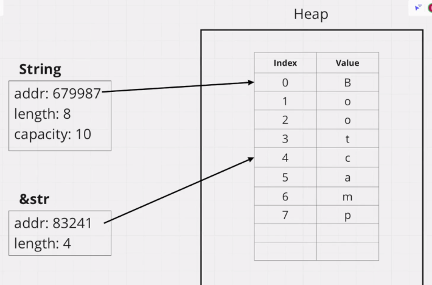

# 切片

## 字符串切片
```rust
let tweet = String::from("a very long text");
let trimmed_tweet: &str = &tweet[0..20];
```
如果从开头开始，可以省略开头的索引；如果到结尾，可以省略结尾的索引。



如果这样用字面量创建字符串，实质上是一个字符串切片。
```rust
let s: &str = "a string";
```
`&String`和`&str`不一样，如果需要开发一个函数同时处理这两种类型，可以这样：
```rust
fn trim_tweet(tweet: &str) -> &str {
	&tweet[..20]
}
```
而不是：
```rust
fn trim_tweet(tweet: &String) -> &str {
	&tweet[..20]
}
```
为什么第一种写法没问题？因为有引用转换机制。

## 数组切片

数组和向量也有切片。